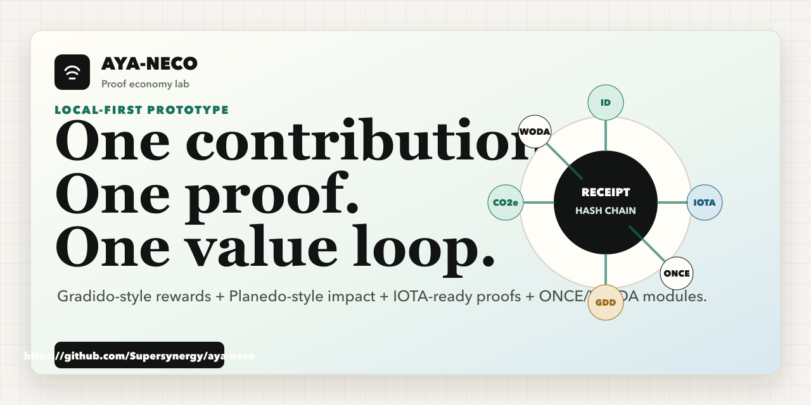
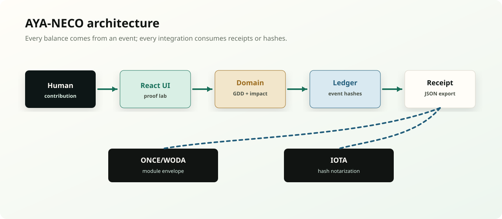
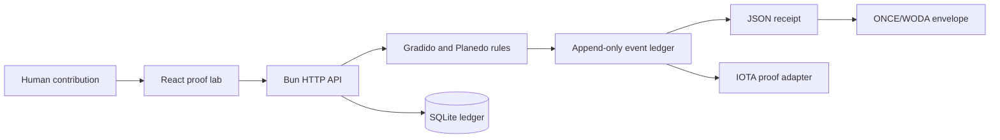
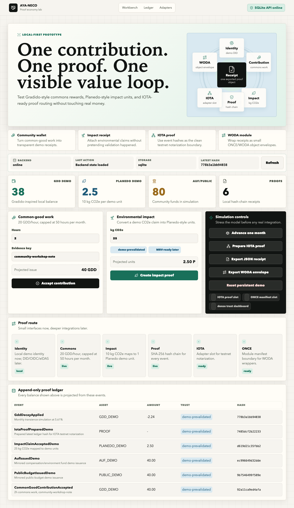
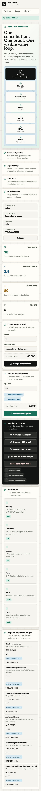

<p align="center">
  
</p>

# AYA-NECO

> Proof-economy lab for builders who want to test common-good rewards, impact claims, identity, and IOTA-ready proofs in one local app.

[](https://github.com/Supersynergy/aya-neco/actions/workflows/ci.yml)
[](LICENSE)
[](https://github.com/Supersynergy/aya-neco)

[Quick start](#quick-start) · [Workflow](docs/WORKFLOW.md) · [Why](docs/WHY.md) · [Architecture](docs/ARCHITECTURE.md) · [ONCE/WODA](docs/ONCE-WODA-INTEGRATION.md) · [Examples](examples)

AYA-NECO is a local-first open-source prototype for a humane, verifiable value loop. It turns one contribution into one inspectable receipt: Gradido-inspired demo rewards, Planedo-inspired demo impact units, a SQLite-backed hash-chain ledger, and adapter boundaries for IOTA and ONCE/WODA.

This is a research/demo app. It is not money, not a token sale, not a production custody wallet, and not an official Gradido, Planedo, IOTA, or ONCE product.

## Vision

AYA-NECO exists to make useful work visible, portable, and verifiable.

Today, communities often depend on spreadsheets, screenshots, trust in one admin, or vague impact claims. A person helps at a food project, repairs bikes, organizes a neighborhood workshop, plants trees, or documents CO2e savings. The work is real, but the proof usually disappears.

AYA-NECO tests a different path:

```text
useful work -> transparent event -> demo balance -> proof receipt -> wallet view -> portable envelope
```

The long-term vision is a common-good wallet that can hold more than money:

- contribution history;
- local demo balances;
- community review status;
- impact receipts;
- proof hashes;
- portable WODA objects;
- future IOTA notarization references.

The point is not to launch another speculative token. The point is to give people and communities a clean proof layer for work, care, environmental impact, and local value creation.

## What You Can Do With It Now

Run the app locally and you can already test the full proof loop:

1. Create a demo identity.
2. Log common-good work, such as `2 hours`.
3. Issue a demo community balance, such as `40 GDD_DEMO`.
4. Mirror the same event into public/AUF demo funds.
5. Add an environmental impact claim, such as `25 kg CO2e`.
6. Store every action in a SQLite hash-chain ledger.
7. Inspect the ledger events, trust levels, amounts, and hashes.
8. Export a JSON receipt.
9. Export the same receipt as an ONCE/WODA-ready envelope.
10. Prepare the latest hash for future IOTA testnet notarization.

That makes AYA-NECO useful as a working prototype for wallet builders, community organizers, impact projects, local-economy experiments, and partner demos.

## Concrete Examples

### 1. Community Contribution Wallet

A local group wants to recognize work that normally stays invisible.

Example:

- Maria helps run a community kitchen for `2 hours`.
- The app records the contribution.
- AYA-NECO issues `40 GDD_DEMO`.
- The ledger also mirrors `40 PUBLIC_DEMO` and `40 AUF_DEMO`.
- Maria can export a receipt that proves what was recorded.

Later, this can become a real community wallet view:

- member identity;
- contribution timeline;
- demo balance;
- community reviewer signatures;
- receipts that can be shared with partners or local projects.

### 2. Environmental Impact Receipt

A project wants to track climate or ecological benefit without pretending that every claim is already certified.

Example:

- A repair cafe estimates `25 kg CO2e` avoided.
- AYA-NECO maps it to `2.5 PLANEDO_DEMO`.
- The event is stored as `demo-prevalidated`.
- The receipt keeps the evidence key and hash.

Later, the same flow can add:

- MRV evidence;
- expert validator signatures;
- partner registry export;
- higher trust levels only when validation actually happened.

### 3. Wallet For Local Projects

A city district, DAO, cooperative, school, or nonprofit can test a local proof wallet.

Example wallet cards:

| Wallet card | What it shows |
|---|---|
| My contributions | Hours, task type, evidence, reviewer status. |
| My demo balance | `GDD_DEMO`, `PLANEDO_DEMO`, AUF/public demo funds. |
| My receipts | Exportable proof objects with hashes. |
| My impact | CO2e or other impact claims with trust level. |
| My portability | WODA envelope for moving proof objects into another runtime. |
| My notarization | Future IOTA proof ids for selected event hashes. |

This is the practical wallet direction: start with proof and explainability, then add identity, review, signatures, and network anchoring.

### 4. Partner And Investor Demo

AYA-NECO gives you something concrete to show:

- click through a contribution;
- show the generated demo balance;
- show the persisted ledger events;
- export the receipt;
- export the WODA envelope;
- explain where IOTA notarization fits later.

That is stronger than a slide deck because the core claim is testable in the browser.

## What It Does

| Layer | What works now | Why it matters |
|---|---|---|
| Identity | Local demo identity with DID/OIDC/eIDAS placeholders | Lets the model stay identity-ready without pretending to be certified. |
| Common good | `20 GDD_DEMO/hour`, capped at 50 hours/month | Makes Gradido-style issuance visible and testable. |
| Impact | `10 kg CO2e = 1 PLANEDO_DEMO` | Shows how MRV-style impact records can enter the same ledger. |
| Ledger | SHA-256 event hash chain | Every balance is explainable from events. |
| Backend | Bun HTTP API + SQLite | The UI is no longer the source of truth. |
| Receipts | JSON export from the UI and scripts | Developers can reuse the output immediately. |
| ONCE/WODA | Module manifest plus envelope bridge | Gives WODA a concrete object/module boundary. |
| IOTA | Adapter slot documented and proof-ready | Starts with local proof, then adds testnet notarization. |

## Workflow In One Pass

```text
user action -> API command -> domain rule -> SQLite hash-chain event
  -> projected balances -> JSON receipt -> WODA envelope or future IOTA proof
```

WODA is currently the portable object boundary: AYA-NECO wraps a receipt into a
`woda.object-envelope.v0` payload with commands and trust boundaries. IOTA is
currently the notarization boundary: the app prepares local event hashes for a
future testnet adapter, but does not submit them yet.

Read the full tool map and original-version comparison in [docs/WORKFLOW.md](docs/WORKFLOW.md).

## Quick Start

```bash
git clone https://github.com/Supersynergy/aya-neco
cd aya-neco
just setup
just check
just dev
```

Open the Vite URL, usually:

```bash
http://127.0.0.1:5173/
```

Expected result:

- a dashboard with demo identity, backend health, balances, contribution controls, impact controls, proof route, and ledger;
- clicking `Accept contribution` creates a `CommonGoodContributionAccepted` event;
- the backend also creates public-budget and AUF mirror events;
- clicking `Create impact proof` creates a `PLANEDO_DEMO` event;
- clicking `Advance one month` applies Gradido-style monthly transience;
- clicking `Export JSON receipt` downloads a reusable receipt.
- clicking `Export WODA envelope` downloads an ONCE/WODA-ready envelope.

## Working Examples

```bash
just examples
```

This creates generated demo artifacts under `data/exports/`:

- `demo-receipt.json`
- `once-woda-envelope.json`

Static examples live in:

- [common-good receipt](examples/receipts/common-good.json)
- [impact proof receipt](examples/receipts/impact-proof.json)
- [ONCE/WODA module manifest](examples/once-woda/aya-neco.module.json)

## What You Can Build With It

| Use case | Start here | Next step |
|---|---|---|
| Community proof wallet | `Common-good work` flow | Replace demo identity with real member identity and a member profile page. |
| Contribution timeline | `ledger_events` table | Show every accepted action, reviewer, evidence key, and hash. |
| Local balance wallet | `projectBalances(events)` | Display `GDD_DEMO`, `PLANEDO_DEMO`, AUF, and public funds per person or group. |
| Community reviewer flow | `trust` levels | Add signatures that move events from `self-declared` to `community-reviewed`. |
| Environmental impact receipt | `Environmental impact` flow | Attach real MRV evidence and validator roles. |
| IOTA notarization demo | `LedgerEvent.hash` | Submit selected hashes to IOTA testnet or Notarization Alpha. |
| ONCE/WODA module | `packages/once-woda/module.manifest.json` | Mount AYA commands as WODA callable objects. |
| Policy sandbox | `packages/domain/src/index.ts` | Change issuance, caps, trust levels, and decay rules. |
| Partner demo | `docs/assets/social-preview.png` and screenshots | Use the README plus `docs/WHY.md` for explanation. |

## Architecture

<p align="center">
  
</p>



The first slice is deliberately local-first. It proves the loop before adding network, custody, identity certification, or partner validation.

## ONCE/WODA Integration

The concrete integration unit is the AYA module manifest:

```bash
node scripts/validate-once-woda-manifest.mjs
node scripts/once-woda-envelope.mjs examples/receipts/common-good.json
```

The manifest defines commands, inputs, outputs, safety boundaries, and runtime assumptions. WODA should call AYA as a module boundary first, not embed the whole app as a monolith.

Read the full integration guide: [docs/ONCE-WODA-INTEGRATION.md](docs/ONCE-WODA-INTEGRATION.md).

## UI System

The first UI slice uses UniversalUI decisions and vendored Lucide SVGs:

- Icon assets: `apps/app/src/assets/icons/lucide`
- UI ADR: `docs/adr/2026-06-04-universalui-ui-system.md`
- Source attribution: `NOTICE`

Selected Lucide icons are copied into `apps/app/src/assets/icons/lucide` so the app has no runtime icon dependency.

## Screenshots

| Desktop | Mobile |
|---|---|
|  |  |

## Commands

```bash
just setup            # install dependencies
just dev              # run API + app
just test             # run domain, API, and app tests
just build            # typecheck and build
just examples         # generate demo receipt and ONCE/WODA envelope
just check            # examples + tests + build
just release-check    # structure + check + asset gate
```

## Configuration

| Variable | Required | Default | Purpose |
|---|---:|---|---|
| `PORT` | no | `8787` | Backend API port. |
| `AYA_NECO_DB` | no | `data/aya-neco.sqlite` | SQLite DB path relative to `apps/api`. |
| `VITE_API_BASE_URL` | no | `http://127.0.0.1:8787` | Frontend API target. |
| `VITE_ENABLE_IOTA_PROOF` | no | `false` | Keeps IOTA proof disabled until configured. |
| `VITE_IOTA_RPC_URL` | no | empty | Future IOTA RPC/testnet endpoint. |
| `VITE_IOTA_EXPLORER_URL` | no | `https://explorer.iota.org` | Future proof link base. |

## Safety Boundaries

- Demo units only.
- No exchangeability.
- No token sale.
- No custody.
- No official partner claim.
- No eIDAS/KYC claim.
- No Planedo validation claim unless an external validator actually signs it.

## Docs

- [Why this exists](docs/WHY.md)
- [Workflow and tool roles](docs/WORKFLOW.md)
- [Use cases](docs/USE-CASES.md)
- [Architecture](docs/ARCHITECTURE.md)
- [ONCE/WODA integration](docs/ONCE-WODA-INTEGRATION.md)
- [Best practices](docs/BEST-PRACTICES.md)
- [Product spec](docs/SPEC.md)

## License

MIT for AYA-NECO code. See [LICENSE](LICENSE).

Lucide icons are included under their upstream license. See [NOTICE](NOTICE).
