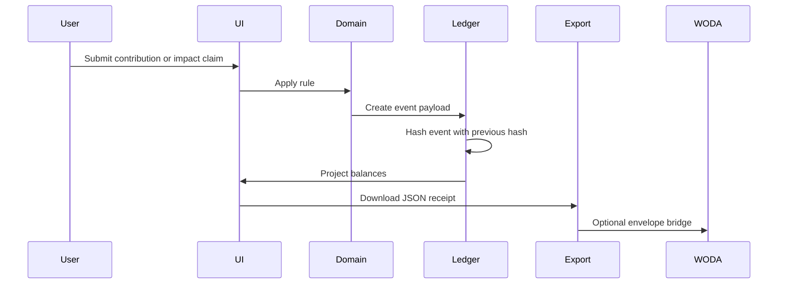

# Architecture

AYA-NECO uses a small, inspectable architecture.

<p align="center">
  
</p>

## Layers

| Layer | Current file | Responsibility |
|---|---|---|
| UI | `apps/app/src/App.tsx` | User-facing proof lab. |
| Components | `apps/app/src/components` | Reusable metric, route, ledger, and graphic panels. |
| Domain rules | `apps/app/src/domain/economy.ts` | Issuance, decay, conversion, event hashing. |
| Icon registry | `apps/app/src/icons/Icon.tsx` | Local UniversalUI/Lucide icon rendering. |
| Examples | `examples/` | Receipts and ONCE/WODA inputs. |
| ONCE/WODA package | `packages/once-woda` | Manifest and adapter contract. |
| Scripts | `scripts/` | Example generation and envelope conversion. |

## Data Flow



## Event Rules

The app does not mutate balances directly as source of truth.

It creates events first, then projects balances:

- `DemoIdentityCreated`
- `CommonGoodContributionAccepted`
- `ImpactClaimAcceptedDemo`
- `GddDecayApplied`

## Trust Levels

Trust levels prevent overclaiming:

| Level | Meaning |
|---|---|
| `self-declared` | User or demo system made the claim. |
| `demo-prevalidated` | Demo rules accepted the event. |
| `community-reviewed` | Future community validation. |
| `expert-mrv-ready` | Future external MRV path. |

## Adapter Direction

Adapters should consume events and receipts, not UI state.

Correct boundary:

```text
Receipt JSON -> adapter -> external proof/runtime
```

Avoid:

```text
External runtime -> DOM scraping -> hidden app state
```

